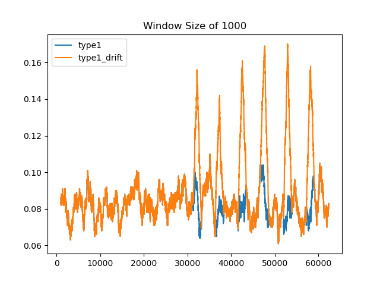
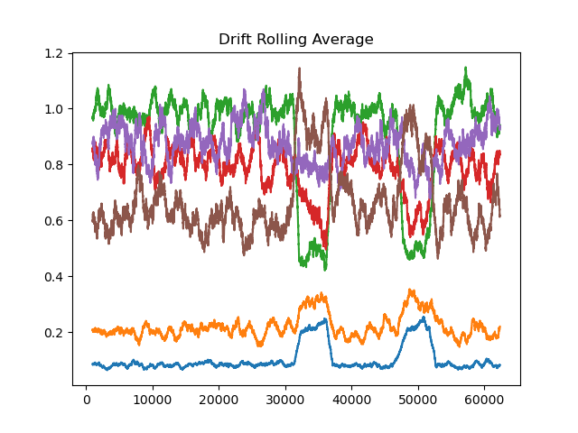
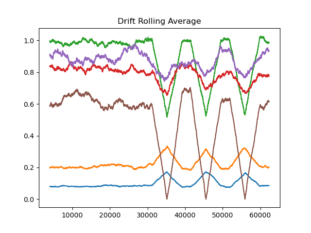

# Concept Drift Algorithms

This repository contains Python implementations of various concept drift detection algorithms for streaming data. Concept drift refers to the phenomenon where the statistical properties of the target variable change over time, leading to a degradation in the performance of machine learning models. The concept drift algorithms provided here can help detect these changes in the data and adapt the models accordingly.

## Algorithms

Under the src folder, The following concept drift algorithms are currently implemented:

1. **Dynamic Moving Range Window (DMRW)**
   - File: `Dynamic_window.py`
   - Function: `DMRW(X, base_classifier, retrain=False, num_std=2, train_labels=None)`
   - Description: This algorithm detects change points in a streaming dataset using a dynamic moving range window approach. It calculates the distance between predicted and actual labels and dynamically adjusts the window size based on the average distance.
  
2. **Ensemble Relevance Window (ERW)**
   - File: `Ensemble_reference_window.py`
   - Function: `ERW(X, n, base_classifier, retrain=False, num_std=4, train_labels=None)`
   - Description: This algorithm detects change points in a streaming dataset using an ensemble relevance window approach. It maintains an ensemble of windows and checks if the mean of the recent window means deviates significantly from the reference window mean.
  
3. **Moving Range Window (MRW)**
   - File: `Moving_reference_window.py`
   - Function: `MRW(X, n, base_classifier, retrain=False, num_std=2, train_labels=None)`
   - Description: This algorithm detects change points in a streaming dataset using a moving range window approach. It compares the mean of the current window with the mean of the reference window and detects a change if the difference exceeds a certain threshold.
  
4. **Fixed Relevance Window (FRW)**
   - File: `Fixed_reference_window.py`
   - Function: `FRW(X, n, base_classifier, retrain=False, num_std=1, train_labels=None)`
   - Description: This algorithm detects change points in a streaming dataset using a fixed relevance window approach. It compares the mean of the current window with the mean of the reference window and detects a change if the difference exceeds a certain threshold.

## Usage

To use any of the concept drift algorithms, follow these steps:

1. Import the desired algorithm from the corresponding Python file.
2. Call the algorithm function with the required arguments and optional parameters.
3. The function will return a tuple containing the list of change point indices and the total number of change points detected.

An example of the usage is included in the Semi-supervised_Concept_Drift.ipynb Python Notebook.

## Pseudo Code for Fixed Reference Window Algorithms:
```shell
function FRW(X, n, base_classifier, retrain=False, num_std=1, train_labels=None):
    sqrt_n = square root of n
    ref = empty list
    cur = empty list
    cur_idx = empty list
    idx = -1
    lst = empty list

    for i in X:
        idx = idx + 1
        prob = base_classifier.predict_proba([i])
        y_index = index of the highest value in prob
        y = array of zeros with length 6
        y[y_index] = 1
        distance = sum of square differences between y and prob, rounded to 4 decimal places

        if length of ref < n:
            append distance to ref
        else if length of cur < n:
            append distance to cur
            append idx to cur_idx
        else:
            remove first element from cur
            append distance to cur
            remove first element from cur_idx
            append idx to cur_idx

            m_cur = mean of cur
            m_ref = mean of ref
            s_ref = standard deviation of ref

            if m_cur >= m_ref + num_std * (s_ref / sqrt_n):
                append idx - n to lst

                if retrain is true:
                    set base_classifier.probability to True
                    fit base_classifier with X[cur_idx] and train_labels[cur_idx]

                ref_idx = empty list
                ref = empty list
                cur = empty list

    return lst, length of lst
```

## Pseudo Code for Fixed Reference Window Algorithms:
```shell
function MRW(X, n, base_classifier, retrain=False, num_std=2, train_labels=None):
    sqrt_n = square root of n
    ref = empty list
    cur = empty list
    cur_idx = empty list
    idx = -1
    lst = empty list

    for i in X:
        idx = idx + 1
        prob = base_classifier.predict_proba([i])
        y_index = index of the highest value in prob
        y = array of zeros with length 6
        y[y_index] = 1
        distance = sum of square differences between y and prob, rounded to 4 decimal places

        if length of ref < n:
            append distance to ref
        else if length of cur < n:
            append distance to cur
            append idx to cur_idx
        else:
            remove first element from ref
            append first element of cur to ref
            remove first element from cur
            append distance to cur
            remove first element from cur_idx
            append idx to cur_idx

            m_cur = mean of cur
            m_ref = mean of ref
            s_ref = standard deviation of ref

            if m_cur >= m_ref + num_std * (s_ref / sqrt_n):
                append idx - n to lst

                if retrain is true:
                    set base_classifier.probability to True
                    fit base_classifier with X[cur_idx] and train_labels[cur_idx]

                clear cur_idx, ref, and cur

    return lst, length of lst
```

## Pseudo Code for Ensemble Reference Window Algorithms:
```shell
function ERW(X, n, base_classifier, retrain=False, num_std=4, train_labels=None):
    sqrt_n = square root of n
    c4 = square root of 2 divided by (n-1) multiplied by factorial of (n/2 - 1) divided by factorial of ((n-1)/2 - 1)

    ref = empty list
    cur = empty list
    cur_idx = empty list
    idx = -1
    lst = empty list
    m_lst = empty list
    s_lst = empty list

    for i in X:
        idx = idx + 1
        prob = base_classifier.predict_proba([i])
        y_index = index of the highest value in prob
        y = array of zeros with length 6
        y[y_index] = 1
        distance = sum of square differences between y and prob, rounded to 4 decimal places

        if length of ref < n:
            append distance to ref
        else if length of cur < n:
            append distance to cur
            append idx to cur_idx
        else:
            remove first element from ref
            append first element of cur to ref
            remove first element from cur
            append distance to cur
            remove first element from cur_idx
            append idx to cur_idx

            append mean of cur to m_lst
            append mean of cur to s_lst

            m_ref = mean of ref

            if mean of m_lst + num_std * (standard deviation of m_lst / sqrt_n) * c4 is less than or equal to m_ref:
                append idx - n to lst

                if retrain is true:
                    set base_classifier.probability to True
                    fit base_classifier with X[cur_idx] and train_labels[cur_idx]

                clear ref, cur, cur_idx, m_lst, and s_lst

    return lst, length of lst
```

## Pseudo Code for Dynamic Moving Reference Window Algorithms:
```shell
function DMRW(X, base_classifier, retrain=False, num_std=2, train_labels=None):
    min_window_size = 100
    max_window_size = 400
    cur_window_size = min_window_size
    ref_window_size = min_window_size

    ref = empty list
    cur = empty list
    cur_idx = empty list
    idx = -1
    lst = empty list

    for i in X:
        idx = idx + 1
        prob = base_classifier.predict_proba([i])
        y_index = index of the highest value in prob
        y = array of zeros with length 6
        y[y_index] = 1
        distance = sum of square differences between y and prob, rounded to 4 decimal places

        if length of ref < cur_window_size:
            append distance to ref
        else if length of cur < cur_window_size:
            append distance to cur
            append idx to cur_idx
        else:
            if length of lst > 2 and difference between second-to-last and last element of lst is greater than 2 times cur_window_size:
                cur_window_size = maximum of min_window_size and cur_window_size minus min_window_size
            else if length of lst > 12 and difference between middle element
```
## Future Directions:
1. **Domain Adaptation**: Study methods for domain adaptation in the context of concept drift. Domain adaptation techniques aim to transfer knowledge from a source domain to a target domain, allowing models to adapt to changing data distributions and concepts.

2. **Feature Selection and Extraction**: Investigate feature selection or extraction techniques that are robust to concept drift. By focusing on the most informative and relevant features, models can be more resilient to changes in the data distribution.

3. **Anomaly Detection**: Explore the intersection of concept drift and anomaly detection. Anomaly detection methods can be used to identify abnormal patterns or instances that indicate concept drift, enabling proactive adaptation of models.

4. **Interpretability and Explainability**: Enhance the interpretability and explainability of concept drift algorithms. Developing methods to explain when and why concept drift occurs can facilitate trust and understanding in the decision-making process.

5. **Real-Time Visualization and Monitoring**: Create real-time visualization and monitoring tools that provide interactive visualizations of concept drift detection results. These tools can help practitioners track concept drift over time and make timely adjustments to models.

## Reference
The development of the dynamic window algorithm is creative and unique, the fixed refererence window, moving reference window and ensemble reference window algorithms references "An efficient concept drift detection method for streaming data under limited labeling":
- Kim, Youngin, and Cheong Hee Park. "An efficient concept drift detection method for streaming data under limited labeling." IEICE Transactions on Information and systems 100, no. 10 (2017): 2537-2546.


<br>
<br>
<br>
<br>


## Drift Injection

Under the drift_injection folder. The purpose of these functions was to produce many types and iterations of drift. 

### Sudden Drift

The Python function inject_sudden_drift() is designed to introduce sudden concept drift into a dataset. Concept drift is a phenomenon in machine learning where the statistical properties of the target variable, which the model tries to predict, change over time in non-stationary environments. This function simulates sudden drift, where the changes in the data distribution occur abruptly.

Here are the parameters for the function:
 - data: The original dataset to which drift is to be introduced.
 - target_variable: The variable in the data that is the target for the model (i.e., the variable we wish to predict).
 - task_type: The type of learning problem - "classification" or "regression".
 - drift_type: The type of drift to be introduced.
 - instances_of_drift: The number of separate instances of drift to be introduced in the data.
 - magnitude_of_drift: The severity of the drift to be introduced - "low", "medium", or "high".
 - drift_length: The number of data points over which the drift will occur.

The function begins by making a deep copy of the data to prevent changes from affecting the original dataset. It determines where the drift should start (middle of the dataset) and how the data should be sectioned for each instance of drift.

The function then checks if the requested drift is feasible given the parameters. If the remaining data points from the drift start index divided by the drift length is less than the instances of drift, it will print an error message and terminate the function.

Depending on the task type ("classification" or "regression"), the function introduces drift in the data differently:

For classification tasks, the function randomly changes the target variable's class over the specified drift length for each instance of drift.
For regression tasks, it introduces a sudden change in the target variable's value by multiplying it with a specified drift amount (determined by the magnitude_of_drift parameter).
The function then returns the manipulated data, where the target variable has been abruptly drifted as specified.

### Gradual Drift

The Python function, inject_gradual_drift(), is designed to manipulate a dataset in order to simulate the effect of gradual concept drift. Concept drift is a phenomenon in machine learning where the statistical properties of the target variable, which the model tries to predict, change over time. This function allows for the simulation of gradual drift, where the change occurs incrementally over time.

Here are the inputs for the function:

 - data: The original dataset to which drift is to be introduced.
 - target_variable: The variable in the data that is the target for the model (i.e., the variable we wish to predict).
 - task_type: The type of learning problem - "classification" or "regression".
 - drift_type: The type of drift to be introduced.
 - instances_of_drift: The number of separate instances of drift to be introduced in the data.
 - magnitude_of_drift: The severity of the drift to be introduced - "low", "medium", or "high".
 - drift_length: The number of data points over which the drift will occur.

The function first makes a deep copy of the data to avoid affecting the original dataset. It then calculates where the drift should start, divides the data into sections, and determines the column index of the target variable.

The function will check if the request drift is possible with the given parameters. If the remaining data points from the drift start index divided by the drift length is less than the instances of drift, it will print an error message and terminate the function.

Depending on the task type ("classification" or "regression"), the function introduces drift in the data differently:

For regression tasks, the function gradually increases the target variable's value over the specified drift length for each instance of drift.
For classification tasks, it alters the distribution of class probabilities gradually over the specified drift length for each instance of drift.
The function then returns the manipulated data, where the target variable has been gradually drifted as specified.

## Injected Drift Visualizations

Below are a few examples of drift injection, visualized for better understanding. The method used to inject the drift below is the same detailed in the pseudocode above. 

The occurence of a single class in a multiclass problem, sudden drift injection:


The occurences of multiple classes in a multiclass problem, gradual drift injection:


The occurences of multiple classes in a multiclass problem, sudden drift injection:

